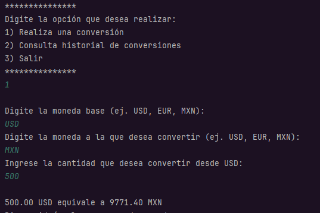

<h1 align="center"> Conversor de Monedas </h1>


Este proyecto es una aplicación de consola en Java que permite convertir montos entre diferentes monedas usando datos en tiempo real proporcionados por la API [ExchangeRate-API](https://www.exchangerate-api.com/).

---

## 🧩 Características de la aplicación

✅ Conversión de monedas en tiempo real usando la API de ExchangeRate API.

✅ Interfaz de línea de comandos amigable para el usuario.

✅ Visualización de tasas de cambio actualizadas.

✅ Validación de entrada para evitar errores comunes.

✅ Preparada para futuras funciones como historial de conversiones.

---

## 🛠️ Requisitos

- JDK 17 o superior
- IDE (como IntelliJ IDEA, VSCode o NetBeans)
- Conexión a internet (para consultar la API)
- Una cuenta gratuita en [ExchangeRate-API](https://www.exchangerate-api.com/) para obtener tu API Key

---

## 💱 Ejemplo de conversión exitosa:




## 🛠 Tecnologías utilizadas                                                                                                                

                                    Lenguaje principal del proyecto                     

       Entorno de desarrollo usado  

                                               Librería para el manejo de JSON  

                                           API para obtener las tasas de cambio en tiempo real

                                                Cliente HTTP de Java para consumir APIs REST        


## 🚀 Cómo ejecutar

1. **Clona o descarga** este repositorio.
2. **Agrega tu API Key** en la clase `Config.java`:

```java
public class Config {
    public static String getApiKey() {
        return "TU_API_KEY_AQUI"; // Reemplaza con tu clave real
    }
}


